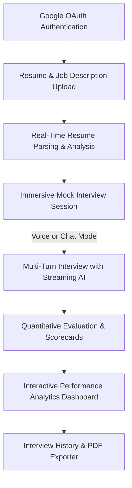

# PrepMe — Interactive AI Mock Interview platform

PrepMe is a premium, state-of-the-art AI-driven interview preparation platform designed to help candidates prepare for target roles through immersive, realistic, conversational mock interviews and high-fidelity evaluations.

Built with a modern, high-contrast aesthetics theme, dynamic transitions, fluid micro-interactions, and native-app mobile feel, PrepMe is optimized for both desktop and touch devices.

---

## 🌟 System Architecture & User Flow

The complete system flow from onboarding to analytics is mapped below:



---

## 🚀 Core Features

### 1. Unified Authentication
* **Single-Click Sign-In**: Integrated with Google OAuth Provider for secure, instant candidate registration and logins.
* **Persistent Sessions**: Automated session verification and API authentication tokens persisted locally across page reloads.

### 2. Deep-Context Resume Analyzer
* **Drag-and-Drop Uploader**: Modern file uploader supporting `.pdf` and `.docx` structures.
* **Context-Driven Mock Preparation**: Scans job descriptions alongside candidate resumes to prepare highly targeted, industry-specific technical and behavioral questions.

### 3. Realistic Mock Interview Simulator
* **Interactive Modality**: Seamlessly switch between text-based **Chat Mode** and conversational **Voice Mode**.
* **Real-Time Streaming**: Stream mock interviewer responses with zero-lag HMR integration.
* **Intelligent Hints Panel**: Provides in-context suggestions and prompts. Features a collapsible, animated toggles drawer (`Voice Hints` & `Chat Hints`) with active-state styling.
* **Safe-State Navigation**: Active session locking via standard warning overlays, preventing accidental loss of interview progress.

### 4. High-Fidelity Feedback & Reports
* **Quantitative Scorecards**: Harmonious, color-coded meters evaluating communication quality, technical accuracy, and role fitness.
* **Code Highlight Visualizers**: Automatically formatting technical code snippet explanations within the conversation.
* **Comprehensive Metrics**: Highlights key strengths, deep areas of improvement, and granular action points.

### 5. Historic Performance Analytics
* **Segmented Progression Tracker**: Sleek segmented progress bars showing current usage limits compared to monthly quotas.
* **Advanced Filters**: Seamless search, target role sorting, and quick-loader triggers to review, refresh, and study past reports.

---

## 🛠 Tech Stack & Design Standards

| Layer | Technologies & Standards |
| :--- | :--- |
| **Core Architecture** | React 18, Vite |
| **Style System** | CSS Modules (Vanilla CSS, HSL Curated Theme Colors, Pure Black Backdrops) |
| **Authentication** | Google OAuth API |
| **Accessibility** | Native keyboard `:focus-visible` states, touch manipulation overrides, `-webkit-tap-highlight` removals |
| **Interactive Assets** | Google Material Symbols, Outfit Typography |

---

## 📦 Getting Started

### Prerequisites
* **Node.js** (v18.0 or above)
* **npm** or **yarn**

### Installation
1. Clone the repository:
   ```bash
   git clone https://github.com/Mayank332k/PrepMe.git
   cd PrepMe
   ```

2. Install dependencies:
   ```bash
   npm install
   ```

3. Configure your environmental values by creating a `.env` file in the root directory:
   ```env
   VITE_GOOGLE_CLIENT_ID=your_google_oauth_client_id.apps.googleusercontent.com
   VITE_API_URL=https://prepme-43ol.onrender.com/api
   ```

4. Launch the local developer server:
   ```bash
   npm run dev
   ```

5. Build the optimized production bundle:
   ```bash
   npm run build
   ```

---

## 🎨 Professional UX & Native Interactions
PrepMe is built with production-grade interactive polishes:
* **Zero Browser Tap Artifacts**: Tap overlays and highlights are disabled globally for native-like touch response.
* **Anti-Selection Guards**: Fast button taps are protected from browser text highlighting or iOS context menus.
* **Subtle Micro-Scaling**: Hover, active click, and toggling interactions scale responsively (`0.97`) to simulate premium tactile hardware button clicks.
* **Accessibility Enforced**: Custom focus styles are hidden on tap but styled with violet focus boundaries for keyboard-only web browsing.
